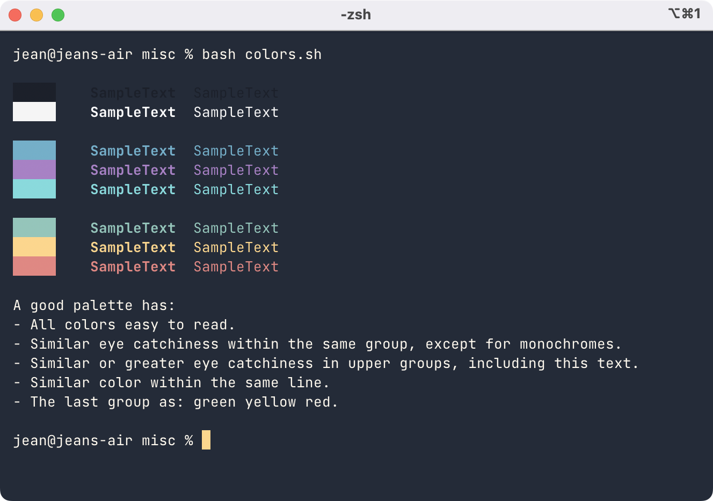

# iTerm2-theme-desaturated

A port of my vscode [Night Shift](https://github.com/Jean-Tinland/vscode-theme-desaturated) (Desaturated) theme to iTerm2.\
You'll find a Google Chrome theme [here](https://github.com/Jean-Tinland/chrome-theme-desaturated).

## Preview

### Dark

### Light

